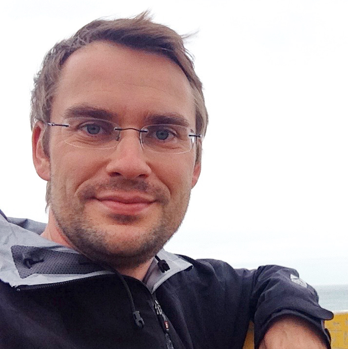

## Introduction

This workshop will bring together the participants of the first [Robotic Vision Challenge](object-detection), a new competition targeting both the computer vision and robotics communities.

The new challenge focuses on **probabilistic object detection**. The novelty is the probabilistic aspect for detection: A [new metric](https://arxiv.org/abs/1811.10800) evaluates both the spatial and semantic uncertainty of the object detector and segmentation system. Providing reliable uncertainty information is essential for robotics applications where actions triggered by erroneous but high-confidence perception can lead to catastrophic results.

## Participate in the Competition
To **participate** in the competition, and for more information around the data and submission format, please go to our [Codalab page](https://competitions.codalab.org/competitions/20940).

Our first challenge requires participants to **detect objects in video** data (from high-fidelity simulation). As a novelty, our evaluation metric rewards accurate estimates of **spatial and semantic uncertainty** using probabilistic bounding boxes.
We developed a new [probability-based detection quality (PDQ)](https://arxiv.org/abs/1811.10800) evaluation measure for this challenge, please see the arxiv paper for more details.

Submissions must be accompanied by a 3-6 page paper ([uploaded via CMT](https://cmt3.research.microsoft.com/ROBVISCHALLENGE2019/)) explaining the method and external data used. Top performing submissions from the challenge will be invited to present their methods at the workshop. A total of $5000 AUD prize money will be rewarded to the competitors, subject to the rules explained on the [Codalab page](https://competitions.codalab.org/competitions/20940).

<iframe width="560" height="315"  src="https://www.youtube.com/embed/6TR97EKUlaM" frameborder="0" allow="accelerometer; autoplay; encrypted-media; gyroscope; picture-in-picture" allowfullscreen></iframe>
<iframe width="560" height="315" src="https://www.youtube.com/embed/LzyTHktKUZ4" frameborder="0" allow="accelerometer; autoplay; encrypted-media; gyroscope; picture-in-picture" allowfullscreen></iframe>

## Important Dates
  * **10 May 2019** Final Submissions to the Evaluation Server via  [Codalab](https://competitions.codalab.org/competitions/20940)
  * **12 May 2019** Paper Submission via [CMT](https://cmt3.research.microsoft.com/ROBVISCHALLENGE2019/)
  * **16 May 2019** Winner Announcements and Workshop Invitations
  * **17 June 2019** Workshop at CVPR

## Invited Speakers
  * [Jana Kosecka](https://cs.gmu.edu/~kosecka/) (George Mason University)
  * [Andreas Geiger](http://www.cvlibs.net/) (University of Tübingen)
  * [Ingmar Posner](https://ori.ox.ac.uk/ori-people/ingmar-posner/) (University of Oxford)

## Schedule
To be announced.

## Organisers

The Robotic Vision Challenges organisers are with the [Australian Centre for Robotic Vision](http://www.roboticvision.org) and [Google AI](http://ai.google/).

  

      <a href="http://www.nikosuenderhauf.info">Niko Sünderhauf</a> Queensland University of Technology

      <a href="http://www.ferasdayoub.com">Feras Dayoub</a>  Queensland University of Technology

      <a href="https://ai.google/research/people/AneliaAngelova">Anelia Angelova</a>   Google Brain

  

      <a href="https://sites.google.com/view/davidhallcv/home">David Hall</a>  Queensland University of Technology

      John Skinner  Queensland University of Technology

      <a href="https://staff.qut.edu.au/staff/haoyang.zhang.acrv">Haoyang Zhang</a>  Queensland University of Technology

      <a href="https://cs.adelaide.edu.au/~carneiro/">Gustavo Carneiro</a>   University of Adelaide

  

## Sponsors

