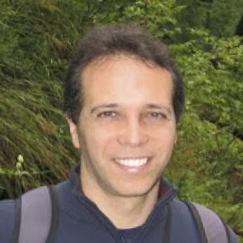

<!-- 
Workshop Acronym - BMREOD
 -->

## Overview
This workshop assesses current evaluation procedures for object detection, highlights their shortcomings and opens discussion for possible improvements.

Through a focus on evaluation using challenges, the object detection community has been able to quickly identify which methods are effective by examining performance metrics. However, as this technological boom progresses, it is important to assess whether our evaluation metrics and procedures adequately align with how object detection will be used in practical applications. **Quantitative results should be easily reconciled with a detector's performance in applied tasks.** This workshop provides a forum to discuss these ideas and evaluate whether current standards meet the needs of the object detection community.

In addition, this workshop is hosting the latest iteration of the Probabilistic Object Detection (PrOD) Challenge which requires competitors to estimate **semantic and spatial uncertainty**.

## Online Workshop Details: 28th August 2020
Due to the current COVID-19 crisis, ECCV is going to be held online with pre-recorded video presentations and two interactive sessions.
Please note that to access the videos and interactive sessions **you will need to be registered for ECCV 2020**.
Login to the ECCV online platform [here](https://eccv.6connex.eu/event/ECCV2020/en-us#!/lobby).

### Video Presentations
We have approximately 45 min presentations by invited speakers and shorter (max 10 min) videos from contributed papers and PrOD Challenge competitors.
Videos are currently available through the ECCV virtual platform.

Please note that video presentations will not be made publicly available until after the ECCV 2020 conference. Links to presentations given below **require you to be logged-in** to the ECCV conference. 

**Invited Speaker/Organizer Presentations:**
* Assistant Prof. [**Emre Akbas**](http://user.ceng.metu.edu.tr/~emre/) (Middle East Technical University): [Unified Evaluation and Training of Object Detectors using Localization-Recall-Precision (LRP)](https://workshopsandtutorials.eccv2020.eu/paper/382/) 
* Assistant Prof. [**Walter Scheirer**](https://www.wjscheirer.com/) (University of Notre Dame): [Visual Psychophysics as an Evaluation Regime for Object Recognition](https://workshopsandtutorials.eccv2020.eu/paper/141/)
* Dr [**Larry Zitnick**](http://larryzitnick.org/) (Facebook AI Research): [The Evaluation Streetlight](https://workshopsandtutorials.eccv2020.eu/paper/383/)
* Dr [**David Hall**](https://sites.google.com/view/davidhallcv/home) (Queensland University of Technology): [Are our detection evaluation norms "enough"](https://workshopsandtutorials.eccv2020.eu/paper/142/)
* Dr [**David Hall**](https://sites.google.com/view/davidhallcv/home) (Queensland University of Technology): [PrOD Challenge Overview and Discussion of Results](https://workshopsandtutorials.eccv2020.eu/paper/143/)

**Workshop Papers**
* [Assessing different box merging strategies and uncertainty estimation methods in multimodel object detection](https://workshopsandtutorials.eccv2020.eu/paper/806/) - **Felippe Schmoeller Roza**, Maximilian Henne, Karsten Roscher and Stephan Günnemann
* [Implementing Planning KL-Divergenge](https://workshopsandtutorials.eccv2020.eu/paper/805/) - **Jonah Philion**, Amlan Kar and Sanja Fidler
* [ODIN: an Object Detection and Instance Segmentation Diagnosis Framework](https://workshopsandtutorials.eccv2020.eu/paper/807/) - **Rocio Torres**, Piero Fraternali and Jesus Romero
* [Shift Equivariance in Object Detection](https://workshopsandtutorials.eccv2020.eu/paper/799/) - **Marco Manfredi** and Yu Wang

**Probabilistic Object Detection (PrOD) Challenge Papers**
* 1st: [Probabilistic Object Detection with an Ensemble of Experts](https://workshopsandtutorials.eccv2020.eu/paper/802/) - **Dimity Miller**
* 2nd: [EPrOD: Evolved Probabilistic Object Detector with Diverse Samples](https://workshopsandtutorials.eccv2020.eu/paper/804/) - Jaewoong Choi, **Sungwook Lee**, Seunghyun Lee and Byung Cheol Song
* 3rd: [Probabilistic Object Detection via Deep Ensembles](https://workshopsandtutorials.eccv2020.eu/paper/803/) - **Zongyao Lyu**, Nolan Guitierrez, Aditya Rajguru and William Beksi

### Interactive Sessions
We have 2 seperate interactive sessions where ECCV delegates can talk with our invited speakers, accepted paper authors, and some workshop organizers.
Each session will be an interactive panel with questions submitted by members of the community either within the session or in advance through Slido (see link below).
Note **you require ECCV registration** to access the interactive sessions.

**[Submit questions for the panel to discuss](https://app.sli.do/event/v4q9zeul)**

Please make sure if you have a question for a specific panel member that you address them in your question.

**Session 1 28th August 00:00-02:00 UTC+1 - Expected Participants**
* Walter Scheirer
* Larry Zitnick
* Sungwook Lee
* Zongyao Lyu
* Dimity Miller
* Felippe Schmoeller Roza
* Rocio Torres
* David Hall
* Niko Sünderhauf

**Session 2 28th August 08:00-10:00 UTC+1 - Expected Participants**
* Emre Akbas
* Marco Manfredi
* Jonah Philion
* David Hall
* Niko Sünderhauf

## Call for Papers
We invite authors to contribute papers to the workshop. Topics of interest comprise, but are not limited to:
* New evaluation measures/metrics for object detection
* New evaluation/visualization tools to analyze object detection systems
* New evaluation procedures for better understanding object detection performance
* Examinations of current evaluation procedures
* New datasets designed to examine specific challenges in object detection
* New detection methods that provide contributions/insights unrewarded by current evaluation procedures (e.g. improved detector calibration, probabilistic object detection, etc.)

### Author Instructions:
* Submissions must follow the full submission guidelines outlined [here](https://docs.google.com/document/d/1epHp4ghHPgzCJeSPAtWL9mdhMWtKRlED9zSZaqlh9CE/edit?usp=sharing)
* Papers are to be in ECCV Submission format (anonymised).
* Before ECCV decisions:
  * papers submitted to workshop **cannot be shorter than 4 pages** (max 14 pages)
  * if a paper submitted to a workshop has a substantial overlap with a paper submitted to a ECCV it **must** be exactly 4 pages long
* After ECCV decisions:
  * 4-page long papers that overlap with a rejected paper can be published in the workshop proceedings (can be longer than 4 pages)
  * 4-page long papers that overlap with a paper accepted to ECCV can present at the workshop but the paper will not be published in the workshop proceedings.
* Submit your paper through [CMT](https://cmt3.research.microsoft.com/BMREOD2020)
* Accepted papers will get to present a short (10 min max) video for the workshop and authors should be available for one of the workshop's interactive sessions.
  * This video **cannot** be made publicly available until after the ECCV 2020 conference
* If you have not already registered for ECCV 2020, accepted papers will have access to the early registration discount after acceptance and only need to register as regular delegates.

## Participate in the Competition
To **participate** in the competition, and for more information around the data and submission format, please go to our [Codalab Page](https://competitions.codalab.org/competitions/20597).

Our challenge requires participants to **detect objects in video** data (from high-fidelity simulation). As a novelty, our evaluation metric rewards accurate estimates of **spatial and semantic uncertainty** using probabilistic bounding boxes.
We developed a new [probability-based detection quality (PDQ)](https://arxiv.org/abs/1811.10800) evaluation measure for this challenge, please see the arxiv paper for more details.

Submissions must be accompanied by a paper **following the guidelines above** explaining the method and external data used. Top performing submissions from the challenge will be invited to present their methods for the workshop.

<iframe width="560" height="315"  src="https://www.youtube.com/embed/6TR97EKUlaM" frameborder="0" allow="accelerometer; autoplay; encrypted-media; gyroscope; picture-in-picture" allowfullscreen></iframe>
<iframe width="560" height="315" src="https://www.youtube.com/embed/LzyTHktKUZ4" frameborder="0" allow="accelerometer; autoplay; encrypted-media; gyroscope; picture-in-picture" allowfullscreen></iframe>

## Important Dates
  * **05 August 2020** Final Submissions to the Evaluation Server via Codalab
  * **12 August 2020** Paper Submission (Workshop and Challenge) via [CMT](https://cmt3.research.microsoft.com/BMREOD2020)
  * **15 August 2020** Winner Announcements and Workshop Invitations
  * **21 August 2020** Videos and photo-ready papers for Workshop due
  * **28 August 2020** ECCV Workshop Interactive sessions (00:00 - 02:00 and 08:00-10:00 UTC+1)

## Organisers

The workshop organisers are with the [Australian Centre for Robotic Vision](http://www.roboticvision.org)

  

      <a href="https://sites.google.com/view/davidhallcv/home">David Hall</a>  Queensland University of Technology

      <a href="http://www.nikosuenderhauf.info">Niko Sünderhauf</a> Queensland University of Technology

      <a href="http://www.ferasdayoub.com">Feras Dayoub</a>  Queensland University of Technology

      <a href="https://cs.adelaide.edu.au/~carneiro/">Gustavo Carneiro</a>   University of Adelaide

       <a href="https://researchers.adelaide.edu.au/profile/chunhua.shen">Chunhua Shen</a>   University of Adelaide

  

## Sponsors

