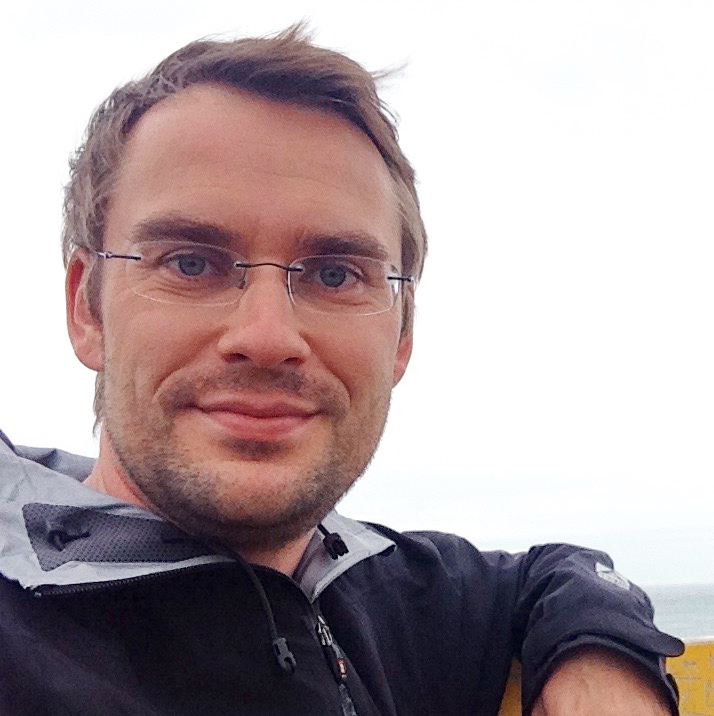
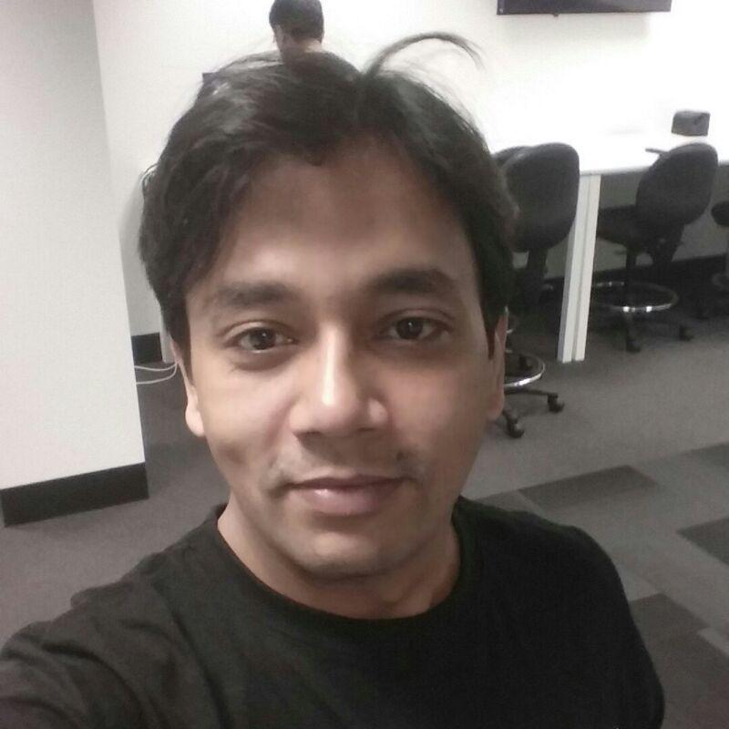
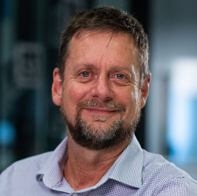

## Overview
Our workshop will discuss the current progress, applications, and limitations of robotic scene understanding and semantic simultaneous localization and mapping (SLAM). We are motivated by the quickly accelerating appearance new research outputs that investigate how classical SLAM techniques and deep-learning based visual object detection or segmentation can be combined in innovative ways, and used to support scene understanding, navigation, and manipulation.

In addition, the workshop will host a new research challenge and competition: The Robotic Vision [Scene Understanding Challenge](scene-understanding) evaluates how well a robotic vision system can understand the semantic and geometric aspects of its environment.

## Call for Papers

Coming soon.

## Call for Participation

Coming soon.

## Program

Coming soon.

## Organisers

The Robotic Vision Challenges organisers are with the [Australian Centre for Robotic Vision](http://www.roboticvision.org) at [Queensland University of Technology (QUT)](https://www.qut.edu.au/), [Monash University](http://www.monash.edu), the [University of Adelaide](http://www.adelaide.edu), and [Google AI](http://ai.google/).

  

      <a href="http://www.nikosuenderhauf.info">Niko Sünderhauf</a> Queensland University of Technology

      <a href="http://www.ferasdayoub.com">Feras Dayoub</a>  Queensland University of Technology

      <a href="https://ai.google/research/people/AneliaAngelova">Anelia Angelova</a>   Google Brain

      <a href="https://sites.google.com/view/alextoshev">Alexander Toshev</a>   Google Brain

  
  

      <a href="http://www.ronnieclark.co.uk/">Ronnie Clark</a>   Imperial College London

      <a href="http://ylatif.github.io/">Yasir Latif</a> University of Adelaide

      <a href="https://www.adelaide.edu.au/directory/ian.reid">Ian Reid</a>  University of Adelaide

      <a href="https://cs.gmu.edu/~kosecka//">Jana Kosecka</a>   George Mason University

  

## Sponsors and Supporters

<!--  -->

