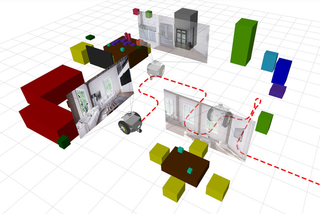

**Due to the COVID-19 crisis, ICRA 2020 has become a fully virtual conference and this workshop is being held in virtual form in the week of 22-26 June 2020.**

## Program

Please join our [Slack channel](https://icra20.slack.com/app_redirect?channel=ws26) for discussions and questions.

We will release pre-recorded presentations in the week of 22-26 June 2020. Details will be communicated shortly. The presenters will be available in our [Slack channel](https://icra20.slack.com/app_redirect?channel=ws26) for discussions.

| **Date** | **Speaker**  |  **Topic** |
| t.b.d. | Luca Carlone (MIT) | t.b.d. |
| t.b.d. | Cesar Cadena (ETH) | t.b.d. |
| t.b.d. | David Hall & Niko Suenderhauf (QUT) | The Scene Understanding Challenge -- Measuring Progress in Semantic SLAM and Robotic Scene Understanding|

## Scene Understanding Challenge -- Call for Participation

The Robotic Vision Scene Understanding Challenge evaluates how well a robotic vision system can understand the semantic and geometric aspects of its environment.
The challenge consists of two distinct tasks: **Object-based Semantic SLAM**, and **Scene Change Detection**.

The challenge is open for submissions since June 2020 and will close 1 September 2020. A cash prize of **$2,500USD** is available for the best participants.

Interested? Please read our [dedicated website](scene-understanding) for more information about the challenge and how to participate. The video below provides a quick overview.

<iframe width="560" height="315" src="https://www.youtube.com/embed/jQPkV29KFvI" frameborder="0" allow="accelerometer; autoplay; encrypted-media; gyroscope; picture-in-picture" allowfullscreen></iframe>

<!--
## Overview
Our workshop will discuss the current progress, applications, and limitations of robotic scene understanding and semantic simultaneous localization and mapping (SLAM). We are motivated by the quickly accelerating appearance new research outputs that investigate how classical SLAM techniques and deep-learning based visual object detection or segmentation can be combined in innovative ways, and used to support scene understanding, navigation, and manipulation.

In addition, the workshop will host a new research challenge and competition: The Robotic Vision [Scene Understanding Challenge](scene-understanding) evaluates how well a robotic vision system can understand the semantic and geometric aspects of its environment. -->

<!-- ## Call for Papers

We invite authors to submit contributed papers to the workshop. The topics of interest comprise, but are not limited to:
 * new approaches of semantic SLAM and object-based SLAM
 * representations of objects as landmarks in SLAM
 * Deep learning for semantic SLAM & semantic SLAM for deep learning
 * End-to-end and explicit scene understanding
 * Incorporating high-level geometric constraints into SLAM
 * Learning and applying object shape priors
 * Incorporating uncertainty techniques and Bayesian deep learning into scene understanding
 * Dynamic SLAM and scene understanding in non-static scenes aided by semantics
 * applications of semantic SLAM and scene understanding
 * success stories and failure cases -->

<!--

### Author Instructions
* Submissions should follow the ICRA format and can be up to 6 pages  long, plus unlimited space for references.
* Please [submit your paper through CMT](https://cmt3.research.microsoft.com/SUSSLAM2020).
* All accepted papers will be presented at a poster session.
* Selected paper will be invited for an oral presentation. -->

<!--
## Call for Participation in the Semantic SLAM Challenge
We will organise a challenge and competition for semantic SLAM and scene understanding in conjunction with the workshop. More information coming soon. Meanwhile, the video below provides an overview of what to expect.

<iframe width="560" height="315" src="https://www.youtube.com/embed/jQPkV29KFvI" frameborder="0" allow="accelerometer; autoplay; encrypted-media; gyroscope; picture-in-picture" allowfullscreen></iframe>

 -->

<!-- ## Program

More information coming soon.

Confirmed invited speakers comprise Andrew Davison, Dieter Fox, Stefanie Tellex and Cesar Cadena. -->

## Organisers

The Robotic Vision Challenges organisers are with the [Australian Centre for Robotic Vision](http://www.roboticvision.org) at [Queensland University of Technology (QUT)](https://www.qut.edu.au/), [Monash University](http://www.monash.edu), the [University of Adelaide](http://www.adelaide.edu), and [Google AI](http://ai.google/).

  

      <a href="http://www.nikosuenderhauf.info">Niko Sünderhauf</a> Queensland University of Technology

      <a href="http://www.ferasdayoub.com">Feras Dayoub</a>  Queensland University of Technology

      <a href="https://ai.google/research/people/AneliaAngelova">Anelia Angelova</a>   Google Brain

      <a href="https://sites.google.com/view/alextoshev">Alexander Toshev</a>   Google Brain

  
  

      <a href="http://www.ronnieclark.co.uk/">Ronnie Clark</a>   Imperial College London

      <a href="http://ylatif.github.io/">Yasir Latif</a> University of Adelaide

      <a href="https://www.adelaide.edu.au/directory/ian.reid">Ian Reid</a>  University of Adelaide

      <a href="https://cs.gmu.edu/~kosecka//">Jana Kosecka</a>   George Mason University

  

## Sponsors and Supporters

<!--  -->

