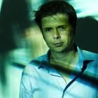

## Introduction
Big benchmark challenges like [ILSVRC](http://www.image-net.org/challenges/LSVRC/) or [COCO](http://cocodataset.org) fuelled much of the remarkable progress in computer vision and deep learning over the past years. We aim to recreate this success story for robotic vision.

We develop a set of new benchmark challenges specifically for robotic vision that evaluate:
   * scene understanding,
   * uncertainty estimation,
   * continuous learning for domain adaptation,
   * continuous learning to incorporate previuosly unseen classes,
   * active learning, and
   * active vision.

We combine the variety and complexity of real-world data with the flexibility of synthetic graphics and physics engines.

Expect the challenges to go live around **November 2018**.

## News

  **June 2018:** We organise two workshops at CVPR and RSS. Meet us at the workshop on [Real-World Challenges and New Benchmarks for Deep Learning in Robotic Vision](https://sites.google.com/view/cvpr2018-robotic-vision) at CVPR in Salt Lake City, and at the workshop on
 [New Benchmarks, Metrics, and Competitions for Robotic Learning](https://sites.google.com/view/rss2018-robotic-learning/home) at RSS in Pittsburgh.

## Motivation
Big computer vision challenges and competitions like [ILSVRC](http://www.image-net.org/challenges/LSVRC/) or [COCO](http://cocodataset.org) had a significant influence on the advancements in object recognition, object detection, semantic segmentation, image captioning, and visual question answering in recent years. These challenges posed motivating problems to the research community and proposed datasets and evaluation metrics that allowed to compare different approaches in a standardized way.

However, visual perception for robotics faces challenges that are not well covered or evaluated by the existing benchmarks.
These challenges comprise calibrated uncertainty estimation, continuous learning for domain adaptation and incorporation of novel classes, active learning, and active vision.

There is currently a lack of meaningful standardised evaluation protocols and benchmarks for these research challenges. This is a significant roadblock for the evolution of robotic vision, and impedes reproducible and comparable research.

We believe that by posing a new robotic vision challenge to the research community, we can motivate computer vision and robotic vision researchers around the world to develop solutions that lead to more capable, more robust, and more widely applicable robotic vision systems.

<!-- [principles](principles) -->

## Organisers, Support, and Acknowledgements

  

      <a href="http://www.nikosuenderhauf.info">Niko Sünderhauf</a> Queensland University of Technology

      <a href="http://www.ferasdayoub.com">Feras Dayoub</a>  Queensland University of Technology

      David Hall  Queensland University of Technology

      John Skinner  Queensland University of Technology

  

The Robotic Vision Challenges organisers are with the [Australian Centre for Robotic Vision](http://www.roboticvision.org).
This project is supported by a **Google Faculty Research Award** to Niko Sünderhauf in 2018.

### Supporters
We thank the following supporters for their valuable input and engaging discussions.

  
  
  

      <a href="https://cs.adelaide.edu.au/users/hengel/">Anton van den Hengel</a>   University of Adelaide

      <a href="https://cs.adelaide.edu.au/~carneiro/">Gustavo Carneiro</a>   University of Adelaide

      <a href="https://ai.google/research/people/AneliaAngelova">Anelia Angelova</a>   Google Brain

  
