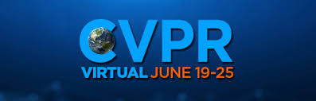
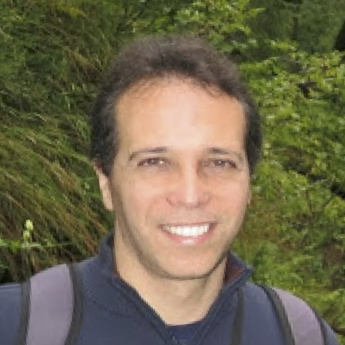

# Introduction
>Big benchmark challenges like [ILSVRC](http://www.image-net.org/challenges/LSVRC/) or [COCO](http://cocodataset.org) supported much of the remarkable progress in computer vision and deep learning over the past years.
>
>We aim to recreate this success for robotic vision.

We develop a set of new benchmark challenges specifically for robotic vision, and evaluate:
   * scene understanding,
   * uncertainty estimation,
   * continuous learning for domain adaptation, and to incorporate previuosly unseen classes,
   * active learning,
   * active vision, and eventually
   * complex tasks requiring a combination of scene understanding, learning, navigation, and interaction with the environment.

We combine the variety and complexity of real-world data with the flexibility of synthetic graphics and physics engines.

<!--
Expect the first challenges to go live around **November 2018**.

https://competitions.codalab.org/competitions/20940 -->

<!-- ## Active Challenges -->

# New Challenge - Robotic Scene Understanding
The Robotic Vision [Scene Understanding Challenge](scene-understanding) evaluates how well a robotic vision system can understand the semantic and geometric aspects of its environment.
There will be two tasks in this challenge: **Object-based Semantic Mapping / SLAM**, and **Scene Change Detection**.

This challenge is now open for [participation](https://evalai.cloudcv.org/web/challenges/challenge-page/625/overview) (deadline 7th May 2020). **$,2500 USD** in cash prizes (thanks to the [Australian Centre for Robotic Vision](http://www.roboticvision.org) and **2 GPUs** (thanks to Nvidia) are available to the best teams.
This challenge is being run in association with the CVPR2021 workshop for [Embodied AI Challenges](https://embodied-ai.org/).

<!-- We will present the results of the challenge at our workshop on the topic of [Scene Understanding and Semantic SLAM: Progress, Applications, and Limitations](icra2020) at ICRA 2020 in Paris, France. Stay tuned for further information, we expect the challenge server to come online in **Feburary 2020**. In the meantime, you can find more information [here](scene-understanding) and in the video below. -->

<iframe width="560" height="315" src="https://www.youtube.com/embed/jQPkV29KFvI" frameborder="0" allow="accelerometer; autoplay; encrypted-media; gyroscope; picture-in-picture" allowfullscreen></iframe>

# First Challenge - Probabilistic Object Detection (PrOD)

Our [probabilistic object detection challenge](object-detection) requires participants to **detect objects in video** data from high-fidelity simulation. As a novelty, our evaluation metric rewards accurate estimates of **spatial and semantic uncertainty** using probabilistic bounding boxes.
To **participate** and for more information around the dataset [read more here](object-detection).

There is no currently active PrOD challenge with prize money available but we do have a continuous evaluation server with its own test set available to promote research in the field of probabilistic object detection.
The continuous evaluation server is running [here](https://competitions.codalab.org/competitions/20595).

<iframe width="560" height="315"  src="https://www.youtube.com/embed/6TR97EKUlaM" frameborder="0" allow="accelerometer; autoplay; encrypted-media; gyroscope; picture-in-picture" allowfullscreen></iframe>

<!--
We made a *validation* and *test-dev* dataset with a public leaderboard available for ongoing evaluation of probabilistic object detection approaches. In addition, a *test-challenge* dataset and evaluation server will become available when we are organising a public competition. The first of those competitions was organised for a [workshop at CVPR 2019](cvpr2019). The submission server remains open for future competitions. -->

<!--  We organise a workshop at IROS 2019 on the topic of [The Importance of Uncertainty in Deep Learning for Robotics](iros2019). For that workshop, we will run a second round of the [probabilistic object detection challenge](object-detection). Stay tuned for further details.
 -->

<!--  We organised a first competition and [workshop at CVPR 2019](cvpr2019) in June 2019, where the best submissions will be presented and $5000 AUD in prize money will be available to the winning entries. -->

<!-- 

<iframe width="560" height="315" src="https://www.youtube.com/embed/TZbEManAy-c" frameborder="0" allow="accelerometer; autoplay; encrypted-media; gyroscope; picture-in-picture" allowfullscreen></iframe>

<iframe width="560" height="315" src="https://www.youtube.com/embed/ISVkUqxk-sk" frameborder="0" allow="accelerometer; autoplay; encrypted-media; gyroscope; picture-in-picture" allowfullscreen></iframe>

 -->

<!--
 We released our first Robotic Vision [object detection challenge](https://competitions.codalab.org/competitions/20940)! Participants are tasked with **object detection** on a **video** stream, where each detection must provide accurate estimates of **spatial and semantic uncertainty** using probabilistic bounding boxes. Participants are evaluated using a new  measure which will reward accurate estimations of spatial and semantic uncertainty. -->

# News
  **17 February 2021** We launch the second iteration of the [Scene Understanding Challenge](scene-understanding) in association with the [CVPR2021 Embodied AI workshop](https://embodied-ai.org/) (deadline 7th May 2021). **$,2500 USD** in cash and GPU prizes are available to the best teams.

  **29 June 2020** Nvidia kindly supports the Scene Understanding Challenge by providing 2 GPUs as prizes for the best teams. Thank you Nvidia!

  **8 June 2020:** We released the [Scene Understanding Challenge](scene-understanding) and opened it for [participation](https://evalai.cloudcv.org/web/challenges/challenge-page/625/overview) (deadline 1 September 2020). **$,2500 USD** in cash prizes are available to the best teams.

  **January 2020** Our workshop proposal on the topic of [Scene Understanding and Semantic SLAM: Progress, Applications, and Limitations](icra2020) for ICRA 2020 in Paris, France was accepted.

  **November 2019** We organised a workshop at IROS 2019 on the [The Importance of Uncertainty in Deep Learning for Robotics](iros2019). There we presented our second challenge, the [Robotic Vision Scene Understanding](scene-understanding) challenge for the first time.

  **September 2019** Two papers got accepted for publication: [Probabilistic Object Detection: Definition and Evaluation](https://arxiv.org/abs/1811.10800) will appear in the IEEE Winter Conference on Applications of Computer Vision (WACV) in March 2020. The [Nature Machine Intelligence](https://www.nature.com/natmachintell/) journal published our article [A probabilistic challenge for object detection](https://rdcu.be/bQR84) in its September issue.

  **August 2019** We opened our [evaluation servers](https://competitions.codalab.org/competitions/20597) again for the 2nd [Probabilistic Object Detection Challenge](object-detection). Submissions are welcome until 8 October, and the results will be presented at our [workshop at IROS](iros2019) in November.

  **May 2019:** We will organise a workshop at IROS 2019 on the topic of [The Importance of Uncertainty in Deep Learning for Robotics](iros2019). Stay tuned for further details.

  **January 2019:** We are happy to announce that CVPR 2019 is hosting our [workshop](cvpr2019). Participants of our Robotic Vision [object detection challenge](https://competitions.codalab.org/competitions/20940) will present their approaches and results, and we will announce the competition winners at the workshop.

  **December 2018:** We released our first Robotic Vision [object detection challenge](https://competitions.codalab.org/competitions/20940), requiring object detection on video data and rewarding accurate estimates of spatial and semantic uncertainty.

  **June 2018:** We presented our initial ideas for new benchmarks and metrics at two workshops during CVPR and RSS. Thanks to all who engaged in discussions and shared their thoughts during the workshops on [Real-World Challenges and New Benchmarks for Deep Learning in Robotic Vision](https://sites.google.com/view/cvpr2018-robotic-vision) at CVPR, and
 [New Benchmarks, Metrics, and Competitions for Robotic Learning](https://sites.google.com/view/rss2018-robotic-learning/home) at RSS.

 **Stay in touch** and follow us on Twitter for news and announcements: [@robVisChallenge](https://twitter.com/robVisChallenge).

<!-- # Coming Soon

Stay tuned for more challenges, focussing on active vision, and active and continuous learning in 2020. -->

# Motivation
Big computer vision challenges and competitions like [ILSVRC](http://www.image-net.org/challenges/LSVRC/) or [COCO](http://cocodataset.org) had a significant influence on the advancements in object recognition, object detection, semantic segmentation, image captioning, and visual question answering in recent years. These challenges posed motivating problems to the research community and proposed datasets and evaluation metrics that allowed to compare different approaches in a standardized way.

However, visual perception for robotics faces challenges that are not well covered or evaluated by the existing benchmarks.
These challenges comprise calibrated uncertainty estimation, continuous learning for domain adaptation and incorporation of novel classes, active learning, and active vision.

There is currently a lack of meaningful standardised evaluation protocols and benchmarks for these research challenges. This is a significant roadblock for the evolution of robotic vision, and impedes reproducible and comparable research.

We believe that by posing a new robotic vision challenge to the research community, we can motivate computer vision and robotic vision researchers around the world to develop solutions that lead to more capable, more robust, and more widely applicable robotic vision systems.

<!-- [principles](principles) -->

# Organisers, Support, and Acknowledgements

**Stay in touch** and follow us on Twitter for news and announcements: [@robVisChallenge](https://twitter.com/robVisChallenge).

  

      <a href="http://www.nikosuenderhauf.info">Niko Sünderhauf</a> Queensland University of Technology

      <a href="http://www.ferasdayoub.com">Feras Dayoub</a>  Queensland University of Technology

      <a href="https://sites.google.com/view/davidhallcv/home">David Hall</a>  Queensland University of Technology

      John Skinner  Queensland University of Technology

      <a href="https://staff.qut.edu.au/staff/haoyang.zhang.acrv">Haoyang Zhang</a>  Queensland University of Technology

      Ben Talbot  Queensland University of Technology

      Suman Bista  Queensland University of Technology

  

The Robotic Vision Challenges organisers are with the [Australian Centre for Robotic Vision](http://www.roboticvision.org) at Queensland University of Technology (QUT) in Brisbane, Australia.

This project was supported by a **Google Faculty Research Award** to Niko Sünderhauf in 2018. Further support  is provided by Nvidia.

## Supporters
We thank the following supporters for their valuable input and engaging discussions.

  
  
  

      <a href="https://cs.adelaide.edu.au/~carneiro/">Gustavo Carneiro</a>   University of Adelaide

      <a href="https://ai.google/research/people/AneliaAngelova">Anelia Angelova</a>   Google Brain

      <a href="https://cs.adelaide.edu.au/users/hengel/">Anton van den Hengel</a>   University of Adelaide

  
