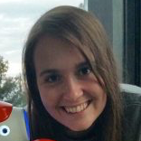
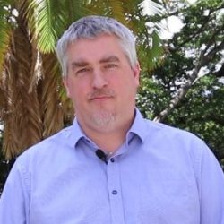

## Overview
In this workshop we will discuss the importance of uncertainty in deep learning for robotic applications. Invited expert speakers will discuss the importance of uncertainty in deep learning for robotic perception, but also action. In addition the workshop will provide a forum to discuss novel and ongoing work.

In addition, the workshop will introduce two new research challenges and competitions:
 * The [Probabilistic Object Detection challenge](object-detection), a new challenge that evaluates the ability of visual object detectors to accurately quantify their spatial and semantic uncertainty.
 * The Robotic Vision [Scene Understanding Challenge](scene-understanding) evaluates how well a robotic vision system can understand the semantic and geometric aspects of its environment.

<!-- The workshop will provide tutorial-style talks that cover the state-of-the-art of uncertainty quantification in deep learning, specifically Bayesian and non-Bayesian approaches, spanning perception, world-modeling, decision making, and actions. -->

## Participate
The workshop will take placein Room L1-R6, on 8 November 2019.

Post your questions for the panel discussion on [slido](https://app.sli.do/event/3sclus5x), using the event code **#IROS-Uncertainty**.

## Schedule

Our workshop features talks by four invited speakers in the morning, followed by a panel discussion before we break for lunch. In the afternoon, the authors of the contributed papers present their work in talks and an interactive poster session.

Please join us **8 November** in Room L1-R6.

| Time | Event |
|-------|--------|
| 09:00 | Welcome, Introduction, Overview  |
| 09.15 | [Hermann Blum](http://n.ethz.ch/~cesarc/) (ETH Zürich): [_**How well does uncertainty estimation actually work?**_](assets/slides/IROS19/HermannBlum.pdf) |
| 09:45 | [Fabio Ramos](http://www-personal.usyd.edu.au/~framos/Home.html)  (NVIDIA, University of Sydney): _**Inferring the uncertainty of simulator parameters for Sim2Real and deep RL**_ |
| 10:15 | [Di Feng](https://frankfengdi.github.io/) (Bosch): [_**Towards Safe Autonomous Driving: Capture Uncertainty in Deep Object Detectors**_](assets/slides/IROS19/DiFeng.pdf) |
| 10:45 | Coffee Break |
| 11:15| [Krzysztof Czarnecki](https://gsd.uwaterloo.ca/kczarnec) (University of Waterloo): _**Uncertainty-Centric Safety Assurance of ML-Based Perception for Automated Driving**_ |
| 11:45 | Workshop Organisers: _**Probabilistic Object Detection and Scene Understanding: Two new Research Challenges and Competitions**._  |
| 12:15 | **Panel Discussion**. Use event code **#IROS-Uncertainty** to post your questions on [slido](https://app.sli.do/event/3sclus5x). |
| 12:45 | Lunch Break  |
| 14:00 | Youngji Kim, Sungho Yoon, Sujung Kim, Ayoung Kim (KAIST and Naver Labs): [_**Balanced Covariance Estimation for Visual Odometry Using Deep Networks.**_](assets/papers/IROS19/kim.pdf) |
| 14:15 | Ali Harakeh, Steven L Waslander. (University of Toronto): [_**How Should We Evaluate Probabilistic Object Detectors?**_](assets/papers/IROS19/harakeh.pdf)|
| 14:30 | Junjiao Tian, Wesley Cheung, Nathan Glaser, Yen-Cheng Liu, Zsolt Kira (Georgia Institute of Technology): [_**UNO: Uncertainty-aware Noisy-Or Multimodal Fusion for Unanticipated Input Degradation**._](assets/papers/IROS19/tian.pdf) |
| 14:45 | Andrea De Maio, Simon Lacroix (LAAS-CNRS): [_**On learning visual odometry errors**._](assets/papers/IROS19/deMaio.pdf) |
| 15:00 | **Closing Remarks** |
| 15:10 | **Poster session** |

<!-- | 15:45 | Coffee Break with Poster Session | -->

<!-- | 14:45 | Felix Leeb, Arunkumar Byravan, Dieter Fox (University of Washington): _**Motion-Nets: 6D Tracking of Unknown Objects in Unseen Environments using RGB**._ | -->

<!-- ## Confirmed Invited Speakers

* [Cesar Cadena](http://n.ethz.ch/~cesarc/), ETH Zürich
* [Fabio Ramos](http://www-personal.usyd.edu.au/~framos/Home.html), University of Sydney
* [Di Feng, Bosch](https://frankfengdi.github.io/) _Towards Safe Autonomous Driving: Capture Uncertainty in Deep Object Detectors_
* [Krzysztof Czarnecki](https://gsd.uwaterloo.ca/kczarnec), (University of Waterloo)
  _Uncertainty-Centric Safety Assurance of ML-Based Perception for Automated Driving_ -->
<!-- ## Call for Contributions and Author Instructions

We welcome contributed papers addressing important questions of uncertainty and reliability of deep learning in robotics.  

### Topics of Interest
   * Uncertainty estimation in deep learning for robotic perception (e.g. object detection, instance segmentation)
   * Propagating uncertainty from perception to actions and decisions
   * Uncertainty in Reinforcement Learning
   * Deep learning in safety critical robotic applications
   * Deep learning in open-set conditions
   * The role of uncertainty for active learning, few-shot learning, and lifelong learning
   * Bayesian Deep Learning, deep probabilistic models
   * Adversarial attacks, safety, failure prediction

### Author Instructions
* Submissions can be made as either **short papers** (1-3 pages), or **regular papers** (4-6 pages plus references).
* Please [submit your paper through CMT](https://cmt3.research.microsoft.com/IUDLR2019), independent of its length. Please use the IROS paper format.
* All accepted papers will be presented at a poster session.
* Selected _regular papers_ (4-6 pages) are invited for an oral presentation and might be invited for a journal special issue we plan to organise.

## Participate in the Probabilistic Object Detection Competition
The workshop will host the [2nd Probabilistic Object Detection challenge](object-detection).

In contrast to conventional object detection, this challenge focuses on the probabilistic aspect of detections: a new metric evaluates both the **spatial and semantic uncertainty** of the object detector. Providing reliable uncertainty information is essential for robotics applications where actions triggered by erroneous but high-confidence perception can lead to catastrophic results.

## Important Dates

### For Contributed Papers
* **15 October:** Deadline for Contributed Paper [Submissions](https://cmt3.research.microsoft.com/IUDLR2019)
* **21 October:** Notification of Authors
* **28 October** Final Papers due
* **8 November 2019:** Workshop at IROS

### For Participation in the Probabilistic Object Detection Challenge
* **6 September:** [Evaluation Server](https://competitions.codalab.org/competitions/20597) for the [Probabilistic Object Detection challenge](object-detection) opens
* **15 October** Final Submissions to the Evaluation Server via [Codalab](https://competitions.codalab.org/competitions/20597)
* **15 October:** Deadline for Submitting Paper Explaining the Approach [Submissions](https://cmt3.research.microsoft.com/IUDLR2019)
* **21 October** Winner Announcements and Workshop Invitations
* **8 November 2019:** Workshop at IROS

 -->

## Organisers

The Robotic Vision Challenges organisers are with the [Australian Centre for Robotic Vision](http://www.roboticvision.org) at [Queensland University of Technology (QUT)](https://www.qut.edu.au/), [Monash University](http://www.monash.edu), the [University of Adelaide](http://www.adelaide.edu), and [Google AI](http://ai.google/).

  

      <a href="http://www.nikosuenderhauf.info">Niko Sünderhauf</a> Queensland University of Technology

      <a href="http://www.ferasdayoub.com">Feras Dayoub</a>  Queensland University of Technology

      <a href="https://www.roboticvision.org/rv_person/dimity-miller/">Dimity Miller</a>   Queensland University of Technology

      <a href="https://ai.google/research/people/AneliaAngelova">Anelia Angelova</a>   Google Brain

  

      <a href="https://sites.google.com/view/davidhallcv/home">David Hall</a>  Queensland University of Technology

      <a href="https://staff.qut.edu.au/staff/haoyang.zhang.acrv">Haoyang Zhang</a>  Queensland University of Technology

      <a href="https://cs.adelaide.edu.au/~carneiro/">Gustavo Carneiro</a>   University of Adelaide

      <a href="https://www.monash.edu/engineering/tomdrummond">Tom Drummond</a>   Monash University

  

## Sponsors

<!--  -->

