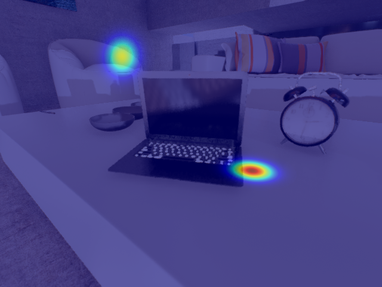
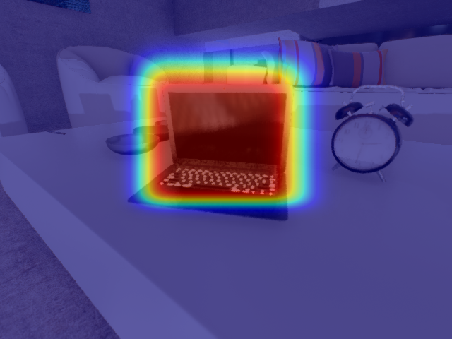
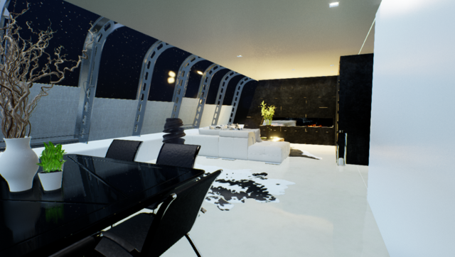
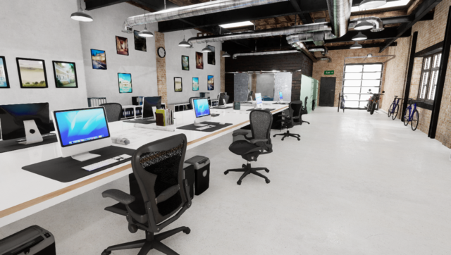
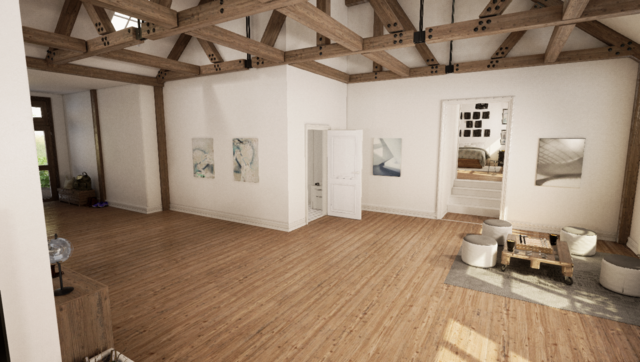

# The Probabilistic Object Detection Challenge

<!-- <h2 class="project-tagline">Evaluating Uncertainty Estimation, Continuous Learning and Active Learning</h2> -->
## Overview
Our first challenge requires participants to **detect objects in video** data produced from high-fidelity simulations. The novelty of this challenge is that participants are rewarded for providing **accurate estimates of both spatial and semantic uncertainty** for every detection using probabilistic bounding boxes.

Accurate spatial and semantic uncertainty estimates are rewarded by our newly developed probability-based detection quality (PDQ) measure. Full details about this new measure are available in our [arxiv paper](https://arxiv.org/abs/1811.10800).

We invite anyone who is interested in object detection and appreciates a good challenge to please participate and compete in the competition so that we may continue to push the state-of-the-art in object detection in directions more suited to robotics applications. We also appreciate any and all feedback about the challenge itself and look forward to hearing from you.


<center>
<iframe width="560" height="315" src="https://www.youtube.com/embed/6TR97EKUlaM" frameborder="0" allow="accelerometer; autoplay; encrypted-media; gyroscope; picture-in-picture" allowfullscreen></iframe>
</center>


## Challenge Participation and Presentation of Results

We maintain two evaluation servers on [Codalab](http://www.codalab.org): **Following a major crash on codalab, our challenge servers are unavailable until September 2019.**
   * An [**ongoing evaluation**](https://competitions.codalab.org/competitions/21727) server with a public leaderboard that remains open year-round and can be used to benchmark your algorithm, e.g. for paper submissions. It contains a validation dataset, and a test-dev dataset.
   * A [**competition evaluation**](https://competitions.codalab.org/competitions/20940) server that will only be available before competitions we organise at major computer vision and robotics conferences.


### Ongoing Evaluation Server
   We maintain an ongoing [evaluation server](https://competitions.codalab.org/competitions/21727) with a public leaderboard that can be used year-round to benchmark your approach for probabilistic object detection.


### IROS 2019 Competition Evaluation Server
 
 We organise a workshop at IROS 2019 (8 November) on the topic of [The Importance of Uncertainty in Deep Learning for Robotics](iros2019). For that workshop, we will run a second round of the [probabilistic object detection challenge](object-detection). Stay tuned for further details. We expect the evaluation server to re-open in September 2019 and close in late October. In the meanwhile, you can use our [ongoing evaluation](https://competitions.codalab.org/competitions/21727) server along with the available validation and test-dev datasets to improve your algorithms.


### CVPR 2019 Competition Evaluation Server

We are organised a competition and [workshop at CVPR 2019](cvpr2019). Four participating teams presented their approaches and results. More details and links to their papers can be found on the [workshop website](cvpr2019).


## How to Cite
When using the dataset and evaluation in your publications, please cite:

```latex
@article{hall2018probability,
  title={Probabilistic Object Detection: Definition and Evaluation},
  author={Hall, David and Dayoub, Feras and Skinner, John, and Zhang, Haoyang and Miller, Dimity and Corke, Peter and Carneiro, Gustavo and Angelova, Anelia and S{\"u}nderhauf, Niko},
  journal={arXiv preprint arXiv:1811.10800},
  year={2018}
}
}
```


<!--  -->

## What is Probabilistic Object Detection?
For robotics applications, detections must not just provide information about *where* and *what* an object is, but must also provide a measure of **spatial and semantic uncertainty**.
Failing to do so can lead to catastrophic consequences from over or under-confident detections.

**Semantic uncertainty** can be provided as a categorical distribution over labels. **Spatial uncertainty** in the context of object detection can be expressed by augmenting the commonly used bounding box format with covariances for their corner points. That is, a bounding box is represented as two Gaussian distributions. See below for an illustration.

<div class="img_row">
  
  
</div>
<div class="col three caption">
      Left: Probabilistic object detections provide bounding box corners as Gaussians (corner point with covariance). Right: This results in a per-pixel probability of belonging to the detected object. Our evaluation takes this spatial uncertainty into account.
</div>

## Datasets
For this challenge, we use realistic simulated data from a domestic robot scenario. The dataset contains scenes with cluttered surfaces, and day and night lighting conditions. We simulate domestic service robots of multiple sizes, resulting in sequences with three different camera heights above the ground plane.

**Following a major crash on codalab, our challenge servers are unavailable until September 2019.**

We maintain three dataset splits:
   * The **test-challenge** dataset is used on the [competition evaluation server](https://competitions.codalab.org/competitions/20940) and only available during open competition phases. It contains over 56,000 images from 18 simulated indoor video sequences, approximately 24GB.
   * The **test-dev** dataset is available on the [ongoing evaluation server](https://competitions.codalab.org/competitions/21727) and can be used to benchmark approaches year-round, e.g. for use in publications. It contains 123,000 images from 18 indoor scenes (different to the test-challenge), day and night lighting variations, and different camera heights above ground simulating different household robots.
   * The **validation** dataset is available on the [ongoing evaluation server](https://competitions.codalab.org/competitions/21727), and contains over 21,000 images in 4 simulated indoor video sequences, approximately 8.8GB. Ground truth information is available for this dataset. It uses the same classes as the test datasets, but different *object models*.


All datasets use the same subset of the Microsoft COCO classes:  
``['bottle', 'cup', 'knife', 'bowl', 'wine glass', 'fork', 'spoon', 'banana', 'apple', 'orange', 'cake', 'potted plant', 'mouse', 'keyboard', 'laptop', 'cell phone', 'book', 'clock', 'chair', 'dining table', 'couch', 'bed', 'toilet', 'television', 'microwave', 'toaster', 'refrigerator', 'oven', 'sink', 'person']``

<div class="img_row_fit">
  
  

  
  
  
</div>
<div class="col three caption">
      Example scenes from the dataset.
</div>


<center>
<iframe width="560" height="315" src="https://www.youtube.com/embed/EffaE3pJyx8" frameborder="0" allow="accelerometer; autoplay; encrypted-media; gyroscope; picture-in-picture" allowfullscreen></iframe>
</center>
<div class="col three caption">
      Scenes from the validation dataset with labeled objects.
</div>

<!--  -->


## New Evaluation Measure - PDQ

We developed a new [probability-based detection quality (PDQ)](https://arxiv.org/abs/1811.10800) evaluation measure for this challenge, please see the [arxiv paper](https://arxiv.org/abs/1811.10800) for more details.

<center>
<iframe width="560" height="315" src="https://www.youtube.com/embed/LzyTHktKUZ4" frameborder="0" allow="accelerometer; autoplay; encrypted-media; gyroscope; picture-in-picture" allowfullscreen></iframe>
</center>

PDQ is a new visual object detector evaluation measure
which not only assesses detection quality, but also accounts
for the spatial and label uncertainties produced by
object detection systems. Current evaluation measures such
as mean average precision (mAP) do not take these two aspects
into account, accepting detections with no spatial uncertainty
and using only the label with the winning score
instead of a full class probability distribution to rank detections.

To overcome these limitations, we propose the
probability-based detection quality (PDQ) measure which
evaluates both spatial and label probabilities, requires no
thresholds to be predefined, and optimally assigns groundtruth
objects to detections.

Our [experimental evaluation](https://arxiv.org/abs/1811.10800) shows that PDQ rewards detections with accurate spatial probabilities and explicitly evaluates label probability to determine detection quality. PDQ aims to encourage the
development of new object detection approaches that provide
meaningful spatial and label uncertainty measures.
