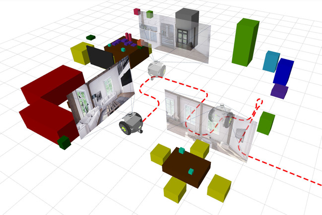
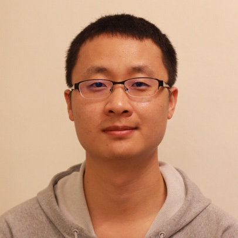
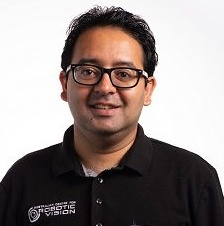
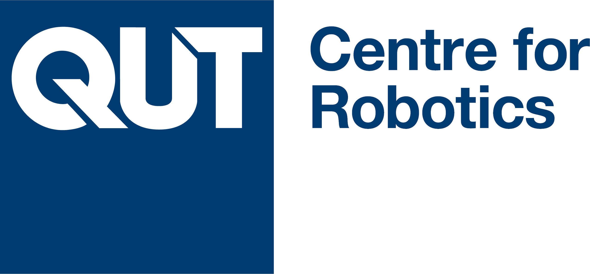

# Robotic Vision Scene Understanding Challenge

## News
 * **29 July 2020** Nvidia confirms 1 Titan RTX and up to 5 Jetson Nanos (1 per team member) for winning teams. 
 * **29 June 2020** Nvidia kindly supports the Scene Understanding Challenge by providing 2 GPUs as prizes for the best teams. Thank you Nvidia!
 * **8 June 2020:** We released our challenge and opened it for [participation](https://evalai.cloudcv.org/web/challenges/challenge-page/625/overview) (deadline 1 September 2020). **$,2500 USD** in cash prizes are available to the best teams.

## Overview
The Robotic Vision Scene Understanding Challenge evaluates how well a robotic vision system can understand the semantic and geometric aspects of its environment.
The challenge consists of two distinct tasks: **Object-based Semantic SLAM**, and **Scene Change Detection**.

Key features of this challenge include:

* [BenchBot](https://github.com/roboticvisionorg/benchbot), a complete software stack for running semantic scene understanding algorithms
* Running algorithms in realistic 3D simulation, and on real robots, with only a few lines of Python code
* The [BenchBot API](https://github.com/roboticvisionorg/benchbot_api), which allows simple interfacing with robots and supports OpenAI Gym-style approaches and a simple object-oriented Agent approach
* Easy-to-use scripts for running simulated environments, executing code on a simulated robot, evaluating semantic scene understanding results, and automating code execution across multiple environments
* $2,500 USD in cash prizes to be split amongst the best participants
* Opportunities for the best teams to execute their code on a real robot in our lab, which uses the same API as the simulated robot
* Use of the [Nvidia Isaac SDK](https://developer.nvidia.com/isaac-sdk) for interfacing with, and simulation of, high fidelity 3D environments

**Watch the video below to learn more!**

<iframe width="560" height="315" src="https://www.youtube.com/embed/jQPkV29KFvI" frameborder="0" allow="accelerometer; autoplay; encrypted-media; gyroscope; picture-in-picture" allowfullscreen></iframe>

<!-- ## Challenge Participation -->

## Challenge Tasks
The semantic scene understanding challenge is split into 3 modes, across 2 different semantic scene understanding tasks, for a total of 6 different challenge variations. The different variations open up the challenge to a wider range of participants, from those who want to focus solely on visual scene understanding to those wish to integrate robot localisation with visual detection algorithms.

The two different semantic scene understanding tasks are:

 1. **Semantic SLAM**: Participants use a robot to traverse around the environment, building up an object-based semantic map from the robot's RGBD sensor observations and odomtry measurements.
 2. **Scene change detection (SCD)**: Participants use a robot to traverse through an environment scene, building up a semantic understanding of the scene. Then the robot is moved to a new start position in the same environment, but with different conditions. Along with a possible change from day to night, the new scene has a number objects added and / or removed. Participants must produce an object-based semantic map describing the changes between the two scenes.

The object-based semantic maps generated by submissions are evaluated against the corresponding ground-truth object-based semantic map (for task 2 this is the map of changes in the second scene, with respect to the first). Please see the [BenchBot Evaluation documentation](https://github.com/roboticvisionorg/benchbot_eval) for details on object-based semantic maps submission formats, and further explanation of the two different tasks.

 Each task has 3 variations, corresponding to the following modes:

 1. **Passive control, with ground-truth localisation**: The robot follows a fixed-trajectory, and participants are given a single method to control the robot: moving to the next pose. The task cannot be continued once the entire trajectory has been traversed. Participants receive ground-truth poses for all robot components after each action.
 2. **Active control, with ground-truth localisation**: The robot can be controlled by either moving forward a requested distance, or rotating on the spot a requested number of degrees. The task cannot be continued if the robot collides with the environment. Participants receive ground-truth poses for all robot components after each action.
 3. **Active control, using dead reckoning (no localisation)**: The robot can be controlled by either moving forward a requested distance, or rotating on the spot a requested number of degrees. Participants receive poses derived from robot odometry after each action, with localisation error that accumulates over time.

Please see the [BenchBot API documentation](https://github.com/roboticvisionorg/benchbot_api) for full details about what actions and observations are available in each mode, and how to use them with your semantic scene understanding algorithms.

## How to Participate

Our challenge **is currently live** (since June 2020), and available [here on the EvalAI website](https://evalai.cloudcv.org/web/challenges/challenge-page/625/overview). Please create an account, sign in, & click the "Participate" tab to enter our challenge. Full details on how to participate, the available software framework, and submission requirements are provided on the site.

The challenge is open until the 1st of September 2020, and a total of **$2,500 USD** will be awarded to high-performing competitors. The best teams at the semantic SLAM and scene change detection challenges respectively shall also receive a **Titan RTX GPU** and up to **5 Jetson Nanos** (1 per team member) provided by our sponsors Nvidia.

Participating in the Semantic Scene Understanding Challenge is as simple as the 4 steps below. The BenchBot software stack is designed from the ground up to eliminate as many obstacles as possible, so you can focus on what matters: solving semantic scene understanding problems. A collection of resources, documentation, and examples are also available within the BenchBot ecosystem to support your experience while participating in the challenge.

To participate in our challenge:
 1. Download & install the [BenchBot software stack](https://github.com/roboticvisionorg/benchbot). Use the [examples](https://github.com/roboticvisionorg/benchbot_examples) to dive straight in & start playing.
 2. Choose a task to start working on a solution for, using `benchbot_run  --list-` tasks to list supported tasks
 3. Start with the development environments "miniroom" and "house" which include ground-truth maps to aid in your algorithm development
 4. Develop a solution using the` benchbot_run`, `benchbot_submit`, & `benchbot_eval` scripts
 5. Create some results for your solution in the challenge environments using:
`benchbot_batch  -t <your_task>  -E <benchbot_root>/batches/challenge/<your_task>  -z  -n <your_submission_cmd>`
 6. Use the Submit tab at the top of our [EvalAI page](https://evalai.cloudcv.org/web/challenges/challenge-page/625/overview) to submit your results for evaluation

## Questions?

Talk to us on [Slack](https://app.slack.com/client/T012ZHR4CQG) or contact us via email at `contact@roboticvisionchallenge.org`.

<!-- Our 2020 competition is also held in conjunction with our ICRA 2020 Workshop ["Scene Understanding and Semantic SLAM: Progress, Applications, and Limitations"](https://nikosuenderhauf.github.io/roboticvisionchallenges/icra2020).

**Note:** Workshop details will be updated due to the COVID-19 Pandemic. -->

<!--
### The BenchBot Software stack
Our Scene Understanding Challenges all use our new software stack called BenchBot. The BenchBot software stack provides user-friendly interfaces (helper scripts & a [simple API]() manages simulation , robot movement, challenge rule enforcement, and evaluation.

To check out the framework and get started on our scene understanding problems, check out the github page at [benchbot.org](https://github.com/RoboticVisionOrg/benchbot).

## The Challenge Tasks

### Task 1: Object-based Semantic Mapping / SLAM

For this task we evaluate how well participants can build a map of the environment that contains all objects of interest. The evaluation metric rewards accurate pose, shape, and object semantics.

This task can be done in one of two modes (Active or Passive) and two Streams (with or without groundtruth camera pose). In Active mode, the user can control the robot's motion to explore the environment. In Passive mode, the user has no control over the robot. In both modes, the user code has access to the data from the robot's RGB-D camera.

### Task 2: Scene Change Detection

The goal of this task is to identify all objects that disappeared, appeared, or moved in an environment from one day to another. The robot can explore the environment on both days, but has to spot all the differences.

This task can be done in one of two modes (Active or Passive) and two Streams (with or without groundtruth camera pose). In Active mode, the user can control the robot's motion to explore the environment. In Passive mode, the user has no control over the robot. In both modes, the user code has access to the data from the robot's RGB-D camera.

**Watch the videos below** Some objects disappeared, some new objects appeared. Can you spot the differences between both days? Which objects are new, which are gone? Can you write an algorithm to solve this problem?
<table><tr><th>Day 1</th><td><iframe width="560" height="315" src="https://www.youtube.com/embed/68zADNn9zLY" frameborder="0" allow="accelerometer; autoplay; encrypted-media; gyroscope; picture-in-picture" allowfullscreen></iframe> </td></tr>
<tr><th>Day 2</th><td> <iframe width="560" height="315" src="https://www.youtube.com/embed/K4udDOlLKTA" frameborder="0" allow="accelerometer; autoplay; encrypted-media; gyroscope; picture-in-picture" allowfullscreen></iframe> </td></tr></table> -->

# Organisers, Support, and Acknowledgements

**Stay in touch** and follow us on Twitter for news and announcements: [@robVisChallenge](https://twitter.com/robVisChallenge).

    <a href="https://sites.google.com/view/davidhallcv/home">David Hall</a>  Queensland University of Technology

      Ben Talbot  Queensland University of Technology

  <a href="https://staff.qut.edu.au/staff/haoyang.zhang.acrv">Haoyang Zhang</a>  Queensland University of Technology

      
      Suman Bista  Queensland University of Technology

      Rohan Smith  Queensland University of Technology

  

      <a href="http://www.ferasdayoub.com">Feras Dayoub</a>  Queensland University of Technology

    <a href="http://www.nikosuenderhauf.info">Niko Sünderhauf</a> Queensland University of Technology    

  

The Robotic Vision Challenges organisers are with the [Australian Centre for Robotic Vision](http://www.roboticvision.org) and the Queensland University of Technology (QUT) [Centre for Robotics](https://research.qut.edu.au/qcr/) in Brisbane, Australia.

<!--  -->

 

