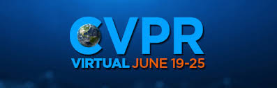
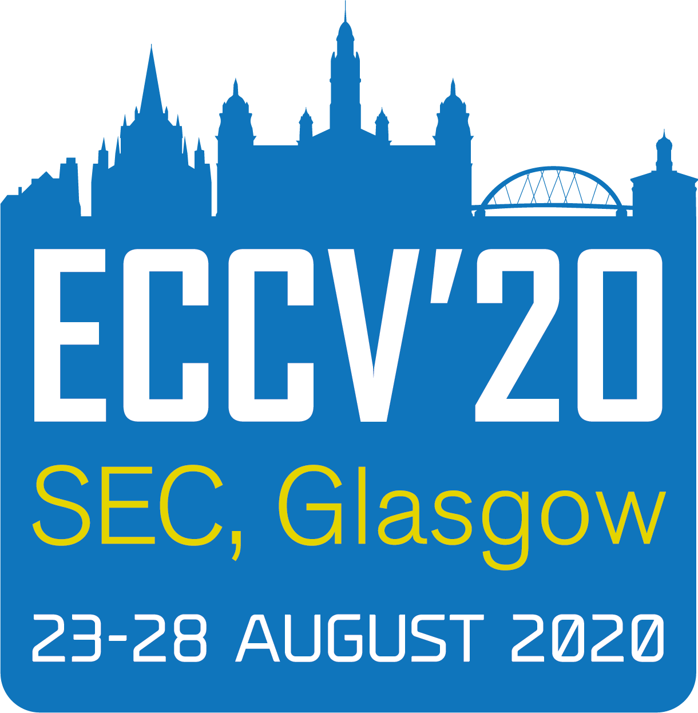
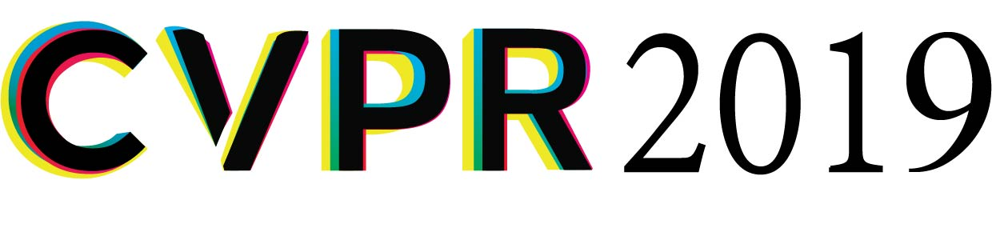

# Workshops

## Upcoming

Our latest Robotic Vision Scene Understanding Challenge launches at the 2021 [**Embodied AI Workshop**](https://embodied-ai.org/) at the Conference on Computer Vision and Pattern Recognition (CVPR), in coordination with eight other embodied AI challenges supported by 15 academic and research organizations. The joint launch of these challenges offers the embodied AI/robotics research community an unprecedented opportunity to move toward a common framework for the field, converging around a unified set of tasks, simulation platforms, and 3D assets. The organizers will collectively share results across all these challenges at CVPR in June, providing a unique viewpoint on the state of embodied AI research and new directions for the subfield.

## Past

Our workshop on [Scene Understanding and Semantic SLAM: Progress, Applications, and Limitations](icra2020) will discuss the current progress, applications, and limitations of robotic scene understanding and semantic simultaneous localization and mapping (SLAM). We are motivated by the quickly accelerating appearance new research outputs that investigate how classical SLAM techniques and deep-learning based visual object detection or segmentation can be combined in innovative ways, and used to support scene understanding, navigation, and manipulation.

[Beyond mAP: Reassessing the Evaluation of Object Detectors](eccv2020) will discuss new evaluation methods for visual object detection, addressing the shortcomings of established techniques concerning issues such as the trade-off between localisation and classification performance, analysis in open-set conditions, uncertainty, and calibration. The workshop will host the 3rd Probabilistic Object Detection Challenge after its appearances at CVPR2019 and IROS2019.
Through this workshop we aim to establish the best practices and approaches that can be used to evaluate object detection systems and continue their applicability and relevance to real-world use-cases.

[The Importance of Uncertainty in Deep Learning for Robotics](iros2019) was the topic of our workshop at IROS 2019.
Invited speakers and contributed papers discussed the importance of uncertainty in deep learning for robotic perception, but also action. We publicly presented our work towards a new [Scene Understanding](scene-understanding) challenge for the first time.

We are organised a competition and [workshop at CVPR 2019](cvpr2019), introducing the probabilistic object detection challenge. Four participating teams presented their approaches and results. More details and links to their papers can be found on the [workshop website](cvpr2019).
